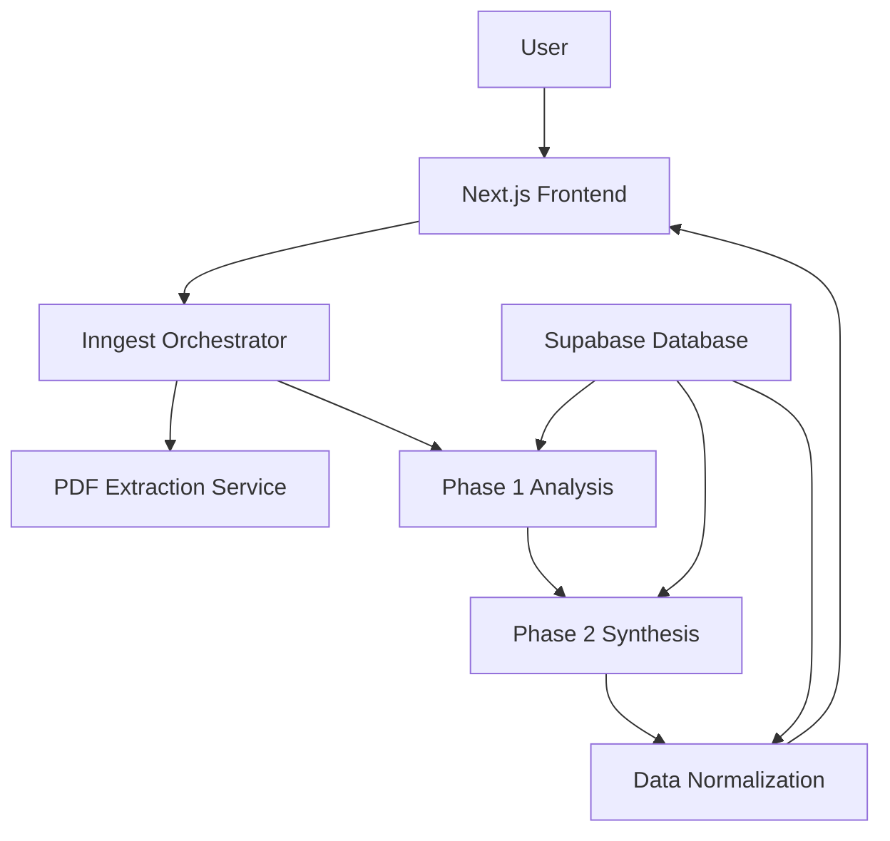

# Technische Architektur

## Überblick

RecruitingDecidor nutzt eine Microservices-Architektur mit 9 spezialisierten Services, die auf Railway deployed sind.

## Service-Architektur



## Services im Detail

### 1. Frontend Service
- **Tech**: Next.js 15.3.2, TypeScript, TailwindCSS
- **Features**: i18n (DE/EN/FR), Responsive Design
- **URL**: https://recruitingdecidor-frontend-production.up.railway.app

### 2. PDF Extraction Service  
- **Tech**: Python, PyMuPDF
- **Performance**: ~0.2s per PDF
- **Fallback**: AI Vision für komplexe Dokumente

### 3. Analysis Service (Phase 1)
- **8 Parallel Module**:
  - Core Job Requirements
  - Skills Analysis
  - Cultural Fit
  - Growth Trajectory
  - Remote Compatibility
  - DEI Analysis
  - Compensation Analysis
  - Team Dynamics

### 4. Synthesis Service (Phase 2)
- **3-Stage Process**:
  1. Context Extraction
  2. Market Analysis
  3. Persona Generation
- **Output**: 5-8 konkrete Menschen-Personas

### 5. Data Normalization Service
- Transformiert AI-Daten in API-friendly Formate
- Chart-ready Endpoints
- Multi-language Support

## Database Schema

```sql
-- Haupttabellen
function_profiles      -- Job-Analyse Daten
job_contexts          -- Markt-Intelligence
talent_segments       -- Generierte Personas
extraction_results    -- PDF Cache

-- Materialized Views für Performance
mv_personas_enriched
mv_funnel_statistics
mv_excluded_talent
```

## Performance Optimierungen

- **PostgreSQL 17**: JSONB GIN Indexes für 50-80% schnellere Queries
- **Railway Auto-scaling**: Automatische Skalierung bei Last
- **Caching**: Redis für häufige Queries
- **Parallel Processing**: 8 Module gleichzeitig in Phase 1

## Security

- Row-Level Security (RLS) auf allen Tabellen
- API Key Rotation
- Verschlüsselte Umgebungsvariablen
- Keine Speicherung von PII

## Deployment

Alle Services sind via GitHub Actions automatisiert:
```bash
git push origin main → Railway Auto-Deploy → Production
```

## Monitoring

- Railway Metrics Dashboard
- Inngest Event Tracking
- Custom Analytics Views in Supabase