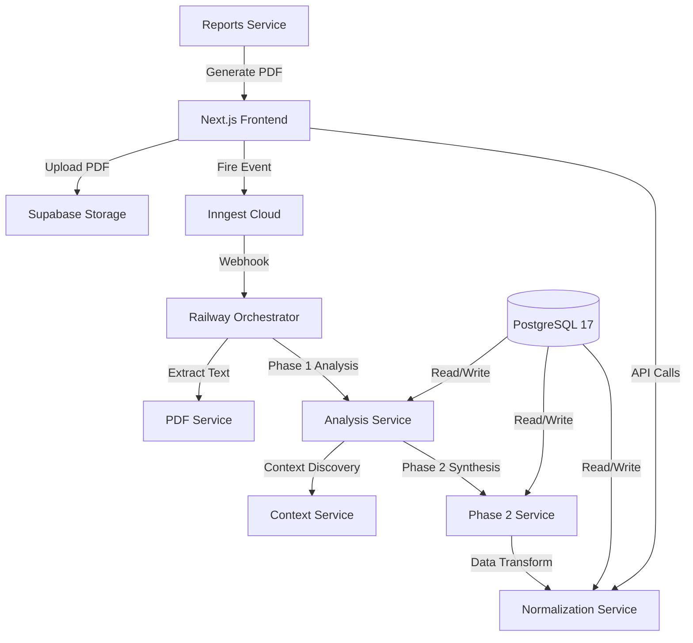

# Technical Architecture Deep-Dive

## The Railway Microservices Decision

**Why microservices?** Supabase Edge Functions have a 2-minute timeout. Our Phase 2 synthesis routinely takes 2-3 minutes. We needed a solution that could handle long-running AI processes without artificial constraints.

**Why Railway?** Simple deployment (git push → production), reasonable pricing, and no Docker complexity on our ARM-based infrastructure.

## System Architecture Overview



## Service Breakdown (The Real Implementation)

### 1. Frontend Service - Next.js Production App
**Location**: `/whoisoutthere/`  
**GitHub**: `https://github.com/Simplycissmus/recruitingdecidor-frontend`  
**Production**: `https://recruitingdecidor-frontend-production.up.railway.app`

**Technical highlights**:
- **i18n Architecture**: Zero hardcoded strings across entire codebase
- **Validation System**: Custom pre-commit hooks catch translation violations
- **Component Standards**: Every component has i18n status in header comments
- **State Management**: Zustand for client state, Supabase for server state
- **Performance**: React 18 concurrent features, Suspense boundaries

```typescript
// Example of bulletproof i18n implementation
const JobDetailPage = () => {
  const t = useTranslations('jobDetail.enriched.overview');
  // Never: <span>Loading...</span>
  // Always: <span>{t('loading')}</span>
};
```

### 2. PDF Extraction Service - PyMuPDF Champion
**GitHub**: `https://github.com/Simplycissmus/recruitingdecidor-pdf`  
**Performance**: ~0.2s per document, 99% cost reduction vs AI

**Multi-strategy extraction**:
1. **PyMuPDF** (primary): Fast, accurate for standard PDFs
2. **Tesseract OCR**: Fallback for scanned documents  
3. **AI Vision**: Last resort for complex layouts

**Caching strategy**: Results stored in `extraction_results` table with content hash for deduplication.

### 3. Analysis Service - The 8-Module Beast
**GitHub**: `https://github.com/Simplycissmus/recruitingdecidor-analysis`  
**Architecture**: 8 parallel Gemini API calls, ~90 seconds total

**The 8 modules**:
1. Core Job Requirements
2. Skills & Technologies Analysis  
3. Cultural Fit Indicators
4. Growth Trajectory Assessment
5. Remote Work Compatibility
6. Diversity & Inclusion Analysis
7. Compensation Structure Analysis
8. Team Dynamics Evaluation

**Rate limiting solution**: Fallback chain (Gemini 2.5 → 2.5 Flash → 1.5 Flash) with graceful degradation.

### 4. Phase 2 Synthesis Service - The Menschen Generator
**GitHub**: `https://github.com/Simplycissmus/recruitingdecidor-phase2`  
**Architecture**: 3-stage pipeline with Swiss market intelligence

**Stage 1: Context Extraction**
```javascript
// Extract all Phase 1 data for comprehensive context
const context = await extractCompleteContext(job_id);
const marketData = await getSwissMarketContext(context.industry, context.region);
```

**Stage 2: Market Analysis**
```javascript
// Analyze Swiss labor market for this specific job type
const demographics = await analyzeDemographics(context, marketData);
const competitionAnalysis = await assessMarketCompetition(context);
```

**Stage 3: Persona Synthesis**
```javascript
// Generate 5-8 concrete Menschen with Swiss demographic backing
const personas = await generatePersonas({
  jobContext: context,
  marketIntelligence: demographics,
  swissSpecifics: { regions, languages, education_systems }
});
```

### 5. Data Normalization Service v2.0 - API Powerhouse
**GitHub**: `https://github.com/Simplycissmus/recruitingdecidor-datanorm`  
**Status**: ✅ PRODUCTION v2.0.0 with enhanced analytics

**Migration achievement**: Absorbed all business logic from deprecated Visualization Service, saving ~€15-20/month Railway costs.

**Key endpoints**:
- `/api/demographics/{job-id}/complete` - Full demographic breakdown
- `/api/demographics/{job-id}/funnel-analysis` - Stage-by-stage filtering
- `/api/jobs/{job-id}/what-if/scenarios` - ROI calculations for job optimization
- `/api/jobs/{job-id}/skills/transferability-enhanced` - Cross-industry skills analysis

**Chart.js integration**: All endpoints return data in Chart.js-ready format with proper labels, colors, and structure.

### 6. Context Discovery Service v3.4.0 - Swiss Market Intelligence
**GitHub**: `https://github.com/Simplycissmus/recruitingdecidor-contextdiscovery`  
**Purpose**: Generate comprehensive Swiss labor market context for Phase 2

**Intelligence gathering**:
- Industry-specific salary ranges and career paths
- Regional employment patterns (Zurich vs Geneva vs Basel)
- Education system integration (apprenticeship, Fachhochschule, ETH)
- Cultural preferences by demographic segment

**Data structure**: Results stored in `job_contexts` table with versioned schema (currently 3.4.0-unbiased).

### 7. Reports Service (In Development)
**GitHub**: `https://github.com/Simplycissmus/recruitingdecidor-reports`  
**Goal**: Beautiful HTML/PDF reports with Human Spectrum visualization

**Planned features**:
- Executive summaries with key insights
- Visual persona representations  
- ROI calculations for optimization suggestions
- Branded templates for different company types

### 8. ~~Visualization Service~~ (Deprecated 2025-07-15)
**Reason for deprecation**: Chart.js and D3.js belong in the frontend, not as separate microservice. Business logic migrated to Data Normalization Service v2.0.0.

**Cost savings**: ~€15-20/month Railway hosting + reduced architectural complexity.

## Database Architecture (PostgreSQL 17.4)

### Performance Revolution (July 2025)
**17 new JSONB GIN indexes** targeting our specific query patterns:

```sql
-- Example: Persona analysis queries
CREATE INDEX idx_fp_phase2_system_b_personas_gin 
ON function_profiles USING gin ((phase2_system_b->'personas'));

-- Demographics lookups
CREATE INDEX idx_jc_market_statistics_gin 
ON job_contexts USING gin ((context_data->'market_statistics'));
```

**Result**: 50-80% faster queries, dashboard loading 2-3x faster.

### Security Implementation
- **Row-Level Security**: All 31 public tables protected
- **50+ RLS policies**: Fine-grained access control
- **Function security**: All 38+ functions use immutable `search_path`
- **API key rotation**: Automated with Railway environment variables

### Materialized Views for Performance
```sql
-- Enriched personas with business calculations
CREATE MATERIALIZED VIEW mv_personas_enriched AS
SELECT 
  job_id,
  persona_data,
  calculated_willingness_ratios,
  barrier_analysis,
  acquisition_value_estimates
FROM talent_segments ts
JOIN function_profiles fp ON ts.profile_id = fp.id;

-- Funnel statistics for conversion analysis  
CREATE MATERIALIZED VIEW mv_funnel_statistics AS
SELECT 
  job_id,
  stage_name,
  pass_rate,
  exclusion_reasons
FROM phase1_analysis_results;
```

## Infrastructure Challenges Solved

### The Timeout Crisis
**Problem**: Supabase Edge Functions timeout at 2 minutes. Our Phase 2 synthesis needs 2-3 minutes.  
**Solution**: Railway microservices with no artificial timeout limits.  
**Implementation**: Inngest orchestration with "fire & forget" pattern.

### The Rate Limiting Nightmare
**Problem**: Gemini 2.5 rate limits are unpredictable and poorly documented.  
**Solution**: Multi-model fallback chain with graceful degradation.
```javascript
const models = ['gemini-2.5', 'gemini-2.5-flash', 'gemini-1.5-flash'];
for (const model of models) {
  try {
    return await generateWithModel(model, prompt);
  } catch (rateLimit) {
    continue; // Try next model
  }
}
```

### The i18n Scale Problem
**Problem**: Maintaining translation consistency across 9 microservices.  
**Solution**: Shared translation validation tools and zero-hardcoded-strings policy.
```bash
# Pre-commit validation
npm run i18n:check  # Must pass before deployment
```

### The Query Performance Wall
**Problem**: PostgreSQL queries hitting 10+ seconds at >1M profile scale.  
**Solution**: Strategic JSONB GIN indexes targeting our specific access patterns.  
**Result**: Sub-200ms API response times.

## Deployment & CI/CD

### Railway Auto-Deploy Pipeline
```bash
# Every service follows this pattern:
git push origin main → GitHub Actions → Railway Build → Production
```

**Zero-downtime deployments**: Railway handles blue-green deployment automatically.

**Environment management**: Separate staging/production environments with automatic promotion.

### Monitoring & Observability
- **Railway Metrics**: CPU, memory, response times per service
- **Inngest Dashboard**: Event tracking, retry patterns, failure analysis  
- **Custom Analytics**: `inngest_analytics` table tracks Railway vs Edge Function performance
- **Health Checks**: `/health` endpoint on every service

## Why This Architecture Works

1. **Scalability**: Each service scales independently based on load
2. **Reliability**: Failure in one service doesn't cascade  
3. **Development Velocity**: Teams can deploy services independently
4. **Cost Optimization**: Only pay for what you use (Railway auto-scaling)
5. **Debugging**: Clear service boundaries make issues easier to isolate

## Future Technical Improvements

- **Service Mesh**: Istio for inter-service communication
- **Caching Layer**: Redis for frequently accessed data
- **ML Pipeline**: Dedicated service for demographic interpolation
- **Real-time Updates**: WebSocket connections for live progress updates

---

*Technical architecture designed for Swiss market specifics and scale. Built with Railway microservices, PostgreSQL 17, and battle-tested JavaScript/TypeScript. Part of the talent intelligence platform at [aeberhard.ai](https://aeberhard.ai).*